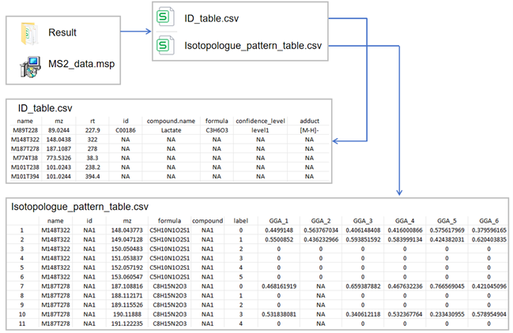
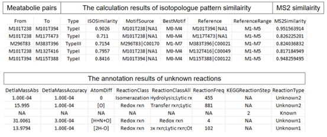

# IsoNet

## Introduction
`IsoNet` is an R package designed for isotopologue similarity networking, aimed at discovering unknown reactions or metabolites. The current source code relies on some in-house packages that have not yet been released. Therefore, users are advised to utilize the Docker image we have built, which includes all necessary dependencies and is easy to use.
The docker image (https://hub.docker.com/r/zhulab/isonet-r) contains entire environment for running `IsoNet`. For convenience and taking fully use of `IsoNet`, users can pull it and run `IsoNet` just as following.

## What is isonet-r

`isonet-r` is a Docker environment to build isotopologue similarity network with `IsoNet` R package. It is based on the [`r-base`](https://hub.docker.com/_/r-base/) docker.

## Pulling image

Users can pull the isonet-r image with the following script

```bash
docker pull zhulab/isonet-r
```

## Data preparation

`IsoNet` requires metabolite identification results and MS2 data pre-processed using `MetDNA2` (https://github.com/ZhuMetLab/MetDNA2), as well as isotopologue pattern table quantified by `MetTracer` (https://github.com/ZhuMetLab/MetTracer). Unlike previous MetTracer preprocessing workflows, unidentified metabolites are annotated using formula prediction. Both known and unknown metabolites are integrated into an annotation table, which is used by MetTracer to extract isotopologues. If users obtained metabolite identification results and isotopologue pattern table via other softwares, please modify your result table as required.

The following files are required by IsoNet for isotopologue similarity networking:
1. A folder named 'Result' containing: isotopologue pattern table (.csv) and identification results (.csv) 

2. The isotopologue patterns of known and unknown labeled metabolites in isotopologue pattern table is used to calculate isotopologue pattern similarity. The first column should be an index, and the remaining column names must be: "name", "id", "mz", "formula", "compound", "label", and sample names.

3. The identification results is used for annotating unknown reactions. The column names must be: "name", "mz", "rt", "id", "compound.name", "formula", "confidence_level", and "adduct". The definitions of confidence level and adduct forms are the same as those used in MetDNA2. level 1: metabolites annotated using in-house metabolite standards with three orthogonal properties (i.e., MS1 + RT + MS/MS); level 2: metabolites annotated using two orthogonal properties from the standard MS/MS libraries without RT available (i.e., MS1 + MS/MS). "level1" or "level2" are considered known metabolites. The forms of adducts should be: “[M-H]-”, “[M-H2O-H]-”, “[M+CH3COO]-”, etc. in negative mode and “[M+H]+”, “[M-H2O+H]+”, “[M+Na]+”, “[M+NH4]+”, etc. in positive mode. Multiple annotation is separate them with `;`.

4. MS2 data files (.msp) for MS2 similarity calculation.

Demo files could be downloaded from [https://www.zhulab.cn/usr/uploads/misc/isonet/IsoNet_demo_data.zip] or [https://doi.org/10.5281/zenodo.14911858].

Overview of the data preparation


## R script preparation
To run the data processing, an R script named [run.R](extra/run.R) should be placed in the data folder.
Here we provide an example.

```R
library(IsoNet)
wd <- '.'
setwd(wd)

constructMIDNet(tracer_table_file = "./Result/Isotopologue_pattern_table.csv",
                ms2_file = "ms2_data.msp",
                id_table = "./Result/ID_table.csv",
                sample_names = c("GGA_1","GGA_2","GGA_3","GGA_4","GGA_5","GGA_6"),
                dir_path = '.',
                mid_cutoff = 0.7,
                mid_fc = 20,
                mid_isoDegree = 0.1,
                mid_min_motifLen = 0.5,
                ms2_score_cutoff = 0.5,
                mid_max_motif = 1000L,
                ignore_max = TRUE,
                scoring_approach = 'gnps',
                mass_diff_freq_cut_off = 4L)
```

**Import parameters**

- `tracer_table_file` - the file name of isotopologue pattern table which contains the labeled fraction of each isotopologue.
- `ms2_file` - the file name of ms2 file.
- `id_table` - the file name of identification table.
- `sample_names` - The sample names in tracer_table_file that be used to calculate isotopologue pattern similarity.
- `mid_cutoff` - the isotopogue pattern similarity score cutoff
- `ms2_score_cutoff` - the MSMS similarity score cutoff
- `mid_fc` - the labeled fraction radio between the highest and the second highest isotopologues to class the type II and type III.
- `mid_isoDegree` - The cutoff for the minimum labeling fraction of highest isotopologue in the motif.
- `mid_min_motifLen` - In Type III, The minimum carbon number of generated motif. For example, setting it to 0.5 indicates that the carbon number of the motif should be at least 50% longer than that of the metabolite with more carbons.
- `mid_max_motif` - In Type III, the maximum number of generated motifs.
- `ignore_max` - In Type I, whether to consider the position of the highest isotopologue. Setting it to TRUE indicates that it is not considered, and the calculation is performed directly.
- `scoring_approach` - The algorithm used for scoring the MSMS simlairty.
- `mass_diff_freq_cut_off` - The threshold for delta masses used for edge annotation based on its frequency in the KEGG database.


## Run data processing work with isonet-r image

- go to your data folder (e.g., data)

```base
cd data
```

- run docker using following code (*User should be permitted to run docker service*)

```bash
# MUST keep the code exactly as it is!
docker run -it --rm -v "$PWD":/data -u $(id -u ${USER}):$(id -g ${USER}) zhulab/isonet-r Rscript run.R
```

- wait till data processing work done

- Explaining `docker run` arguments
  
  - `-v "$PWD":/home/${USER}`: mapping current directory as home directory in docker container
  
  - `-u $(id -u ${USER}):$(id -g ${USER})`: using current user to run the container
  
  - `Rscript ~/run.R`: run run.R in container home directory with `Rscript`  command

## The result 

IsoNet produces a file named "Labeled metabolite pairs.csv", which can be directly imported into Cytoscape to build a network. The results consist of three main components:
1. Metabolite pairs
2. Results of isotopologue pattern similarity and MS2 similarity calculation
3. Annotations of unknown reactions



# License
<a rel="license" href="https://creativecommons.org/licenses/by-nc-nd/4.0/"></a>
  
  This work is licensed under the Attribution-NonCommercial-NoDerivatives 4.0 International (CC BY-NC-ND 4.0)
